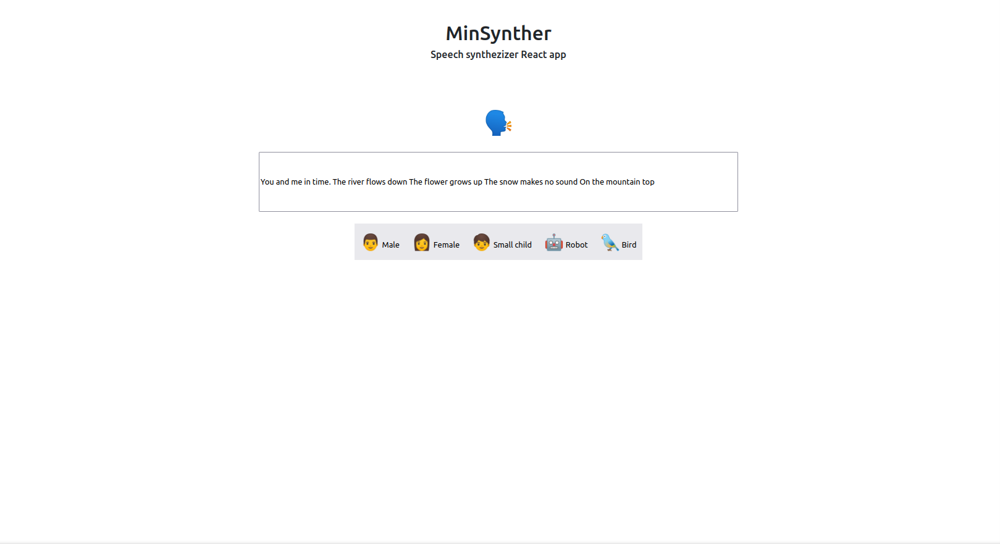

# Txt2Speech

Voice synthesizer app created in React

## Why this app as created:

Proof of concept: App was created both as a proof of concept, and as an initial setup for a future software launch.

## How to use:

1. Clone repo into desired directory `git clone https://github.com/Toughee/Txt2Speech.git` or `gh repo clone Toughee/Txt2Speech`
2. Run `npm install` in your terminal to install all node modules and dependencies
3. Run `yarn start` in your terminal to run app on http://localhost:3000/

## Testing tools used for app:

-   React Testing library
-   TravisCI
-   CircleCI

## Project resources:

-   [Current roadmap for app](https://github.com/Toughee/Txt2Speech/projects/1)
-   [Wiki page for app](https://github.com/Toughee/Txt2Speech/wiki)
-   [Documentation for project contributors](https://github.com/Toughee/Txt2Speech/projects)

### Completed app tasks:

-   [x] Update U.I design for app

### Future app goals:

-   [ ] Assign different speech synthesizer options for each button component
-   [ ] Develop tests for each React component
-   [ ] Perfect U.I. scheme for app to adjust to multiple display dimensions and devices
